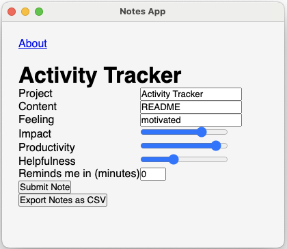

# Activity Tracker
## STILL UNDER DEVELOPMENT

Sometimes I want a detailed view on what I did in a day


## Quickstart

* clone this repo
* cd into the clone
* `npm install` to install dependencies
* `npm start` to start the app


## What does it do?



* Opens a dialog box that asks for:
    * Project (I use my Jira or other larger roll up)
    * Content (What I hope to accomplish in the next N minutes)
    * Feeling (How am I feeling at the moment doing the work?)
    * Impact (1-11 how impactful does my work seem?)
    * Productivity (1-11 how productive do I feel?)
    * Helpfulness (1-11 how helpful will the result be?)
    * Remind me (N minutes until the dialog shows back up)

* Submit - saves responses in `/repo/path/notes/notes.jsonl`
* `/repo/path/notes/notes.jsonl` - this is `jsonl` incase you ever want to Splunk yourself
* Export CSV - collects responses and saves as `/repo/path/notes.csv`
```
cat notes.csv
```

output
```
username,timestamp,project,content,feeling,impact,productivity,helpfulness,remind_time
username,2024-03-04T21:59:15.156Z,Activity Tracker,README,motivated,8,10,4,0
```

## TODO

* dialog for saving csvs
* get some code review
* make a dashboard for activity
* rework Submit as there is some blocking call
